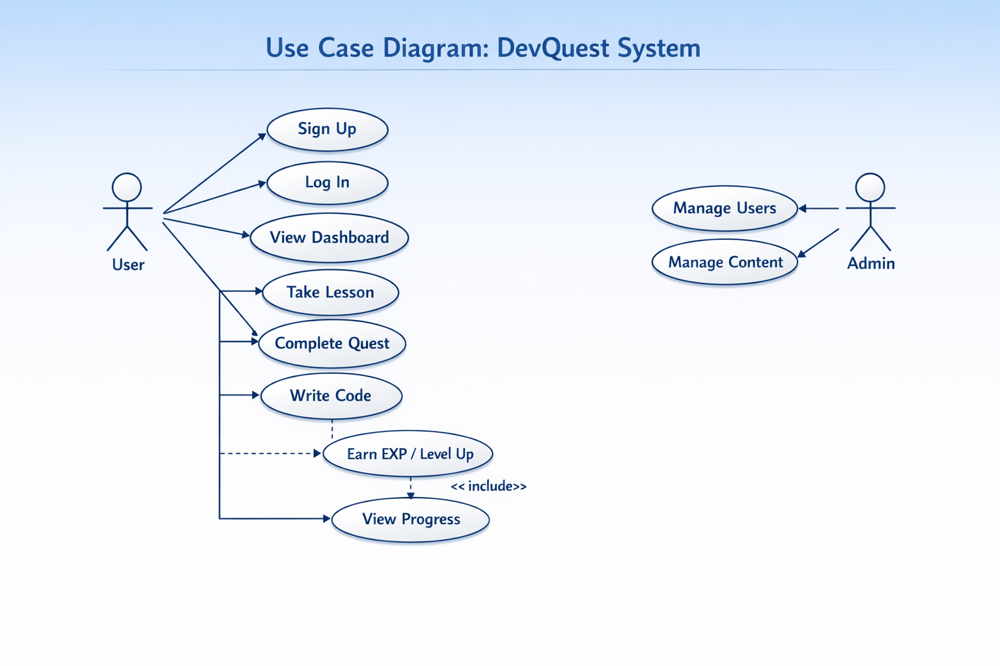
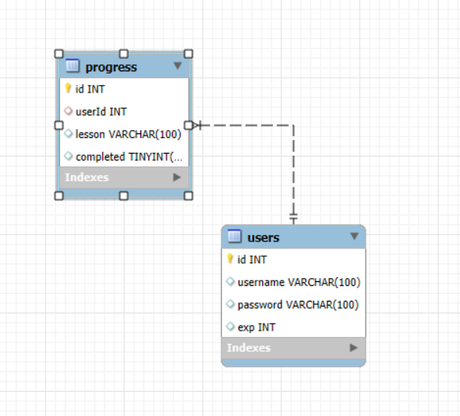

# 📘 เว็บสื่อการสอน HTML (สำหรับนักเรียน ม.6)

## วัตถุประสงค์
เว็บไซต์นี้ถูกพัฒนาขึ้นเพื่อใช้เป็นสื่อการเรียนรู้ภาษา **HTML เบื้องต้น**  
สำหรับนักเรียนระดับมัธยมศึกษาปีที่ 6 โดยเน้นการเรียนรู้ผ่านการทดลองจริง

---

## คุณสมบัติของระบบ

### 1. ระบบบทเรียน

- แสดงเนื้อหา HTML เช่น:
  - โครงสร้าง HTML
  - Text
  - Link
  - Image
  - Table
- มีปุ่ม **Next / Previous** สำหรับเลื่อนบทเรียน

---

###  2. Code Editor (ทดลองเขียนโค้ด)

- ผู้ใช้สามารถพิมพ์โค้ด HTML ได้
- แสดงผลลัพธ์แบบ **Real-time**
- รองรับ:
  - Syntax Highlight
  - Error แจ้งเตือน (เช่น tag ไม่ปิด)
- ใช้ **iframe (Sandbox)** เพื่อความปลอดภัย
- ป้องกันโค้ดอันตราย เช่น `<script>`

---

### 3. ระบบแบบทดสอบ

- แบบปรนัย (Multiple Choice)
- แบบเติมคำ (Fill in the Blank)
- ตรวจคำตอบอัตโนมัติ
- แสดง:
  - คะแนน
  - เฉลย
- สามารถทำซ้ำได้ไม่จำกัด

---

### 4. ระบบนำทาง

- หน้าเรียน
- ทดลองโค้ด
- แบบทดสอบ

---

## ⚙️ เทคโนโลยีที่ใช้
- HTML
- CSS
- JavaScript
- SQLite
- Browser (Chrome, Edge)

---

## ข้อจำกัดของระบบ (Updated Version)

- ไม่มีระบบ Login / Register (ถ้ายังไม่ได้ทำระบบสมาชิก)

- ใช้ฐานข้อมูล SQLite (Local Database)

- รองรับผู้ใช้จำนวนจำกัด (เหมาะกับระบบขนาดเล็ก)

- ไม่เหมาะกับระบบที่มีผู้ใช้งานพร้อมกันจำนวนมาก

---

## ความปลอดภัย (Security)
- ป้องกัน XSS (เช่น `<script>`)
- ทำ **Sanitization** โค้ดก่อนแสดงผล
- ใช้ **Sandbox (iframe)** แยกจากระบบหลัก
- ไม่อนุญาตให้รัน JavaScript จากผู้ใช้

---

## การรองรับอุปกรณ์
- รองรับ:
  - คอมพิวเตอร์
  - มือถือ
  - แท็บเล็ต
- ใช้แนวคิด **Responsive Design**

---

## ผู้ใช้งาน
- นักเรียน (ผู้ใช้งานหลัก)
- ผู้สอน

---

## วิธีใช้งาน
1. เปิดเว็บไซต์ผ่าน Browser
2. เลือกบทเรียนที่ต้องการ
3. ทดลองเขียนโค้ดใน Code Editor
4. ดูผลลัพธ์แบบ Real-time
5. ทำแบบทดสอบเพื่อวัดผล

---

## Assumptions
- ผู้ใช้มีพื้นฐานคอมพิวเตอร์เบื้องต้น
- มีการเชื่อมต่ออินเทอร์เน็ต

---

## แนวคิดของโปรเจกต์
> “เรียน HTML ด้วยการลงมือทำจริง (Learn by Doing)”  
เน้นความเรียบง่าย ใช้งานง่าย และเหมาะสำหรับผู้เริ่มต้น

---

## System Architecture

1. Architecture Pattern

* ใช้รูปแบบ: 3-Tier Architecture

  - Presentation Layer (Frontend)
  - Application Layer (Backend)
  - Data Layer (Database: SQLite)

2. องค์ประกอบของระบบ

### 2.1 Presentation Layer (Frontend)

- ทำงานบน Browser ใช้:

*  HTML / CSS / JavaScript

- หน้าที่:

* แสดงบทเรียน

* Code Editor + Preview

* แบบทดสอบ

### 2.2 Application Layer (Backend)

- ใช้: Node.js + Express

- ทำหน้าที่:

* รับ Request จากผู้ใช้

* ประมวลผล Logic

* เชื่อมต่อ Database

* ตรวจคำตอบแบบทดสอบ

* จัดการ API

##  Use case diagram

## Activity Diagram

## ER Diagram
